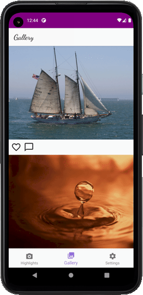
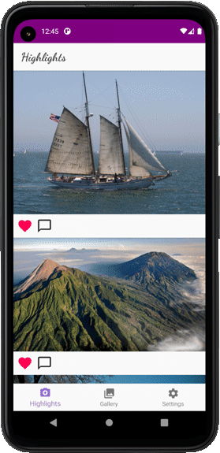
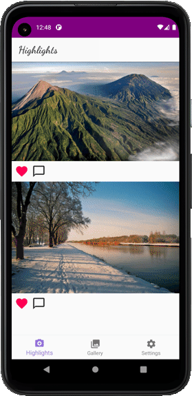
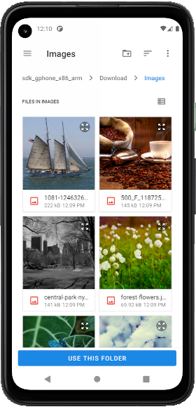

# Lifeviewer

An android app created in my final year at university to be a tool to view [lifelogging](https://en.wikipedia.org/wiki/Lifelog) images.

## Features

Favourite | Unfavourite
-----|-------
 | 

Favouriting images places them in the Highlights tab. This would allow users to select "good" lifelogging images from an unfilterd stream.

Dynamic Scroll |
---------------|--------
 |

Scroll through a list of dynamic length. Expands and shrinks as the number of images in the selected directory changes.

Comment |
--------|-
 |

Comment on any of your images!

Scoped Storage |
--------|-
 |

Only allow the app to see the images *you* want it to with scoped storage access.
No app needs access to *all* of your personal files.